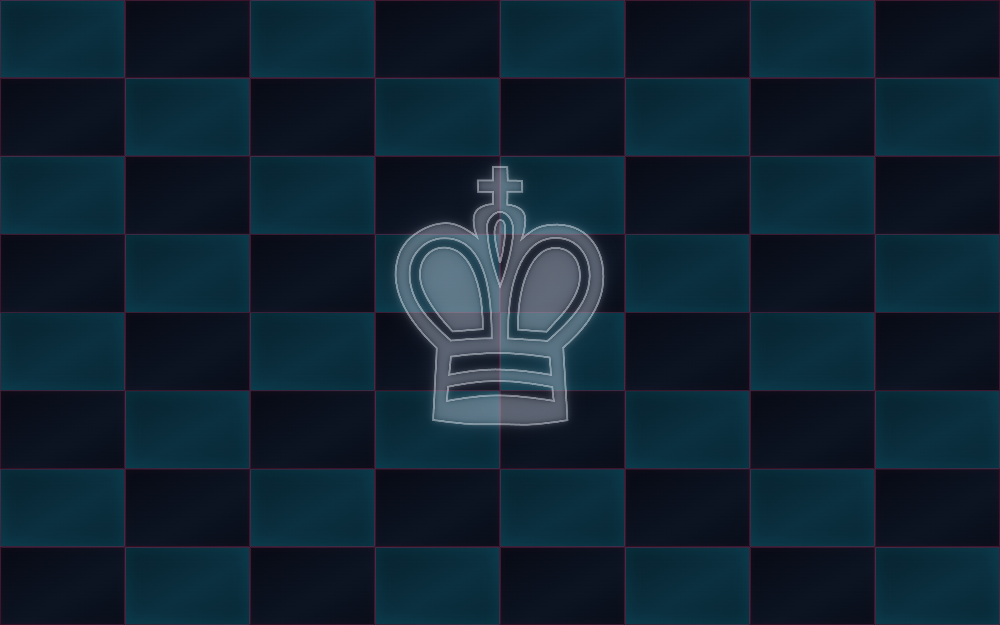

# ChessKing - a Ghostty theme (+ gtheme picker)

A cyberpunk chessboard terminal theme for [Ghostty](https://ghostty.org): a near-black
board with faint cyan light-squares, dim magenta grid lines, and a large framed king
ghosted in the center. Text is Homebrew neon-green, accents are orange, and the cursor
is a magenta block. Ships with **gtheme**, a fuzzy picker that previews and applies any
theme (see below).



## Files (paths from repo root)

| Path | What it is |
|------|-----------|
| `ghostty/themes/ChessKing` | the theme file (palette, foreground, cursor, selection) |
| `ghostty/backgrounds/ChessKing.png` | the chessboard background image (2560x1600) |
| `ghostty/backgrounds/ChessKing.opts` | background-image opts (opacity/position/fit) for ChessKing |
| `ghostty/gtheme` | fuzzy theme picker: preview + apply + load/clear backgrounds |
| `ghostty/install.sh` | installs the theme, board, and gtheme; points your config at ChessKing |
| `generator/chess-cyber.html` | the source the board image is rendered from |
| `generator/render.sh` | re-renders the board PNG from the HTML |

## Requirements

- Ghostty **1.1+** - the `background-image` support this theme uses landed in 1.1.
  The colors alone work on any version; the board is just a background image behind the text.
- `gtheme` additionally needs **fzf** (`brew install fzf`).

## Install

```bash
git clone https://github.com/jgorodetsky/dotfiles.git
cd dotfiles
./ghostty/install.sh
```

Then reload Ghostty: **macOS** `Cmd+Shift+,` / **Linux** `Ctrl+Shift+,` (or restart it).
`ghostty/install.sh` is idempotent.

### What ghostty/install.sh does

1. Copies `ChessKing` into `~/.config/ghostty/themes/`
2. Copies the board + opts into `~/.config/ghostty/backgrounds/`
3. Copies `gtheme` into `~/.config/ghostty/` (alias it - see below)
4. Appends a managed block to your Ghostty config:

```
theme = ChessKing
background-image = ~/.config/ghostty/backgrounds/ChessKing.png
background-image-opacity = 0.6
background-image-position = center
background-image-fit = cover
background-image-repeat = false
```

The `background-image` line is written as a real absolute path for your user.

> **macOS note:** Ghostty reads `~/Library/Application Support/com.mitchellh.ghostty/config`
> as well as `~/.config/ghostty/config`. ghostty/install.sh writes to whichever it finds (App Support
> first), matching what gtheme uses.

## Manual install

```bash
mkdir -p ~/.config/ghostty/themes ~/.config/ghostty/backgrounds
cp ghostty/themes/ChessKing            ~/.config/ghostty/themes/
cp ghostty/backgrounds/ChessKing.png   ~/.config/ghostty/backgrounds/
cp ghostty/backgrounds/ChessKing.opts  ~/.config/ghostty/backgrounds/
cp ghostty/gtheme ~/.config/ghostty/ && chmod +x ~/.config/ghostty/gtheme
```

Then add the config block above to your Ghostty config, using the absolute path to the PNG.

## Tuning

- **Board too strong/faint behind text?** change `background-image-opacity` (0.0-1.0) in
  `~/.config/ghostty/backgrounds/ChessKing.opts`. 0.6 is the default.
- **Different text color?** edit `foreground` in `~/.config/ghostty/themes/ChessKing`.
  `cursor-color` is the magenta block; `palette = 6` / `palette = 14` are the orange accents.

## Regenerating the board

The PNG ships pre-rendered. Only needed to change the board itself - edit
`generator/chess-cyber.html`, then:

```bash
./generator/render.sh    # writes ghostty/backgrounds/ChessKing.png
```

Re-run `./ghostty/install.sh` afterwards to copy it into place.

## gtheme - a theme picker that actually applies

Ghostty's built-in `ghostty +list-themes` gives you a fuzzy browser with live previews, but
it's read-only - it never touches your config. `gtheme` fills that gap: same fuzzy search +
color preview, but **Enter applies the theme** - it writes `theme =` into your config,
loads/clears the theme's background image, and hot-reloads.

```bash
~/.config/ghostty/gtheme                  # pick + apply
alias gtheme='~/.config/ghostty/gtheme'   # add to ~/.zshrc
```

- Lists all built-in themes **plus** your custom ones in `~/.config/ghostty/themes`.
- Preview pane shows each theme's 16-color palette as swatches + a `foreground`-on-
  `background` sample line, and flags themes that carry a background image.
- On Enter it rewrites `theme =`, syncs the background, and hot-reloads.
- Needs **fzf**. Auto-reload on macOS sends `Cmd+Shift+,` via `osascript` (needs Accessibility
  permission); without it, gtheme still applies and you press `Cmd+Shift+,` yourself.

### Per-theme background images

gtheme owns the `background-image` block and keeps it in sync with the selected theme. To
give a theme a background, drop files in `~/.config/ghostty/backgrounds/`:

- `FOO.png` (or `.jpg`/`.jpeg`) - the image, matched to the theme name `FOO`
- `FOO.opts` (optional) - `background-image-*` lines (opacity/position/fit/repeat); if
  omitted, defaults to opacity 0.85, center, cover, no-repeat

Pick `FOO` and gtheme loads it; pick any theme without a matching file and gtheme clears the
image. `ChessKing.png` + `ChessKing.opts` ship set up this way. Add more picture-themes just
by dropping the two files - no code changes.

Reload behavior: colors **and** background images hot-reload on Cmd+Shift+, - gtheme points
each theme at its own image file (or none), and Ghostty picks up a `background-image` path
change on reload. The only exception is replacing an image's *contents* at the same path
(Ghostty caches decoded images by path), which normal theme-switching never does.

## Uninstall

Remove the managed block from your Ghostty config (the `>>> ChessKing` / `<<< ChessKing`
markers and everything between, plus any `>>> gtheme bg >>>` block), then:

```bash
rm ~/.config/ghostty/themes/ChessKing
rm ~/.config/ghostty/backgrounds/ChessKing.*
rm ~/.config/ghostty/gtheme
```
